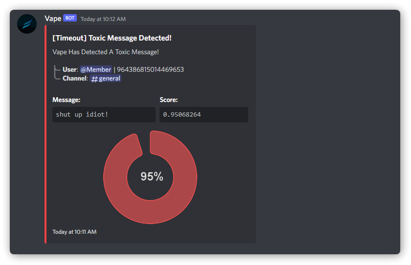
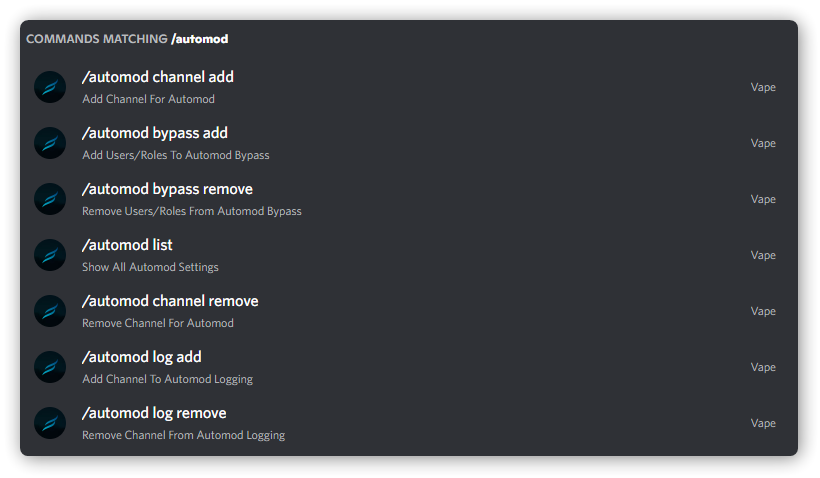

# ** Multi-Guild AI Moderation System**

An advanced multi guild AI Moderation for Discord.js bots
<br/>
<br/>

## ** Preview**

<br/>
<div display="flex">
    
    
</div>
<br/>
<br/>

## ** Packages**
<br/>

```bash
npm i chartjs chartjs-node-canvas perspective-api-client
```
